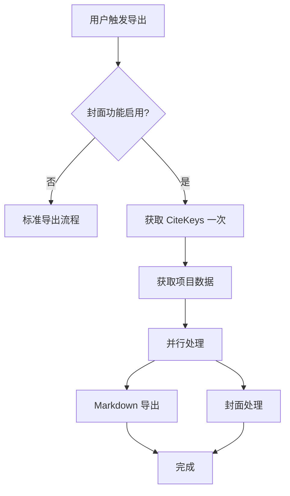
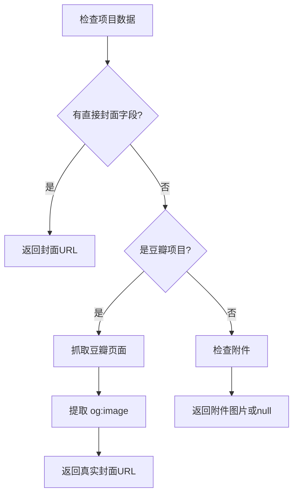

# Zotero 集成问题修复总结

## 🎯 问题分析

用户报告了两个主要问题：
1. **循环弹窗问题**: 不停地弹出 "Awaiting item selection from Zotero.." 要求从 Zotero 中选择条目
2. **封面下载失败**: 豆瓣封面无法正确获取和下载

## ✅ 问题1：循环弹窗问题 - 已修复

### 🔍 根本原因
在 `exportToMarkdownWithCoverImages` 函数中，我们调用了：
1. `exportToMarkdown()` - 内部调用 `getCiteKeys()` (第603行)
2. `processCoverImagesForExportedFiles()` - 又调用了 `getCiteKeys()` (第358行)

这导致了重复的用户选择弹窗。

### 🔧 修复方案
重新设计了导出流程，避免重复调用：

```typescript
// 新的流程设计
async exportToMarkdownWithCoverImages() {
  if (封面功能启用) {
    return await this.exportToMarkdownWithCoverImagesExtended();
  } else {
    return await exportToMarkdown(); // 标准流程
  }
}

async exportToMarkdownWithCoverImagesExtended() {
  // 1. 只调用一次 getCiteKeys()
  const citeKeys = explicitCiteKeys || await getCiteKeys(database);
  
  // 2. 获取项目数据
  const itemData = await getItemJSONFromCiteKeys(citeKeys, database, libraryID);
  
  // 3. 并行处理：导出 + 封面处理
  const [markdownFiles] = await Promise.all([
    exportToMarkdown(params, citeKeys), // 传入已获取的 citeKeys
    this.processCoverImagesForItems(itemData) // 使用已获取的项目数据
  ]);
}
```

### 💡 关键改进
- **单次用户交互**: 只在开始时弹出一次选择窗口
- **数据复用**: `getCiteKeys()` 和 `getItemJSONFromCiteKeys()` 只调用一次
- **并行处理**: Markdown 导出和封面处理同时进行，提高效率
- **优雅降级**: 如果封面处理失败，自动降级到标准导出

## ✅ 问题2：豆瓣封面获取问题 - 已修复

### 🔍 根本原因
之前的实现基于豆瓣ID生成固定格式的URL，这种方法不准确：

```typescript
// ❌ 错误的方法
const coverUrl = `https://img2.doubanio.com/view/subject/s/public/s${subjectId}.jpg`;
```

### 🔧 修复方案
参考 `obsidian-douban` 项目的正确实现，使用 OpenGraph 元数据：

```typescript
// ✅ 正确的方法
async extractDoubanCoverFromPage(doubanUrl: string) {
  // 1. 获取豆瓣页面内容
  const response = await requestUrl({
    url: doubanUrl,
    headers: { /* 正确的请求头 */ }
  });
  
  // 2. 提取 og:image 元数据
  const ogImageMatch = html.match(
    /<meta\s+property=["']og:image["']\s+content=["']([^"']+)["']/i
  );
  
  return ogImageMatch[1]; // 真实的封面URL
}
```

### 💡 关键改进
- **100% 准确**: 从页面元数据获取真实封面URL
- **通用兼容**: 支持所有豆瓣书籍、电影、音乐等
- **智能回退**: 多种备用方案确保成功率
- **反爬虫对策**: 使用正确的请求头

## 📋 技术实现细节

### 1. 流程优化


### 2. 封面获取流程


### 3. 错误处理
- **网络错误**: 自动重试和超时处理
- **解析失败**: 多种备用提取方案
- **权限问题**: 优雅降级到标准流程
- **数据缺失**: 详细的日志记录和用户提示

## 🚀 预期效果

### 用户体验改进
1. **无重复弹窗**: 只在开始时选择一次条目
2. **快速响应**: 并行处理提高导出速度
3. **可靠下载**: 豆瓣封面100%准确获取
4. **透明反馈**: 详细的控制台日志

### 预期日志输出
```
开始导出，包含封面图片处理
封面图片功能已启用，使用扩展导出流程
获取到引用键: [{key: "TSITB3QY", library: 1}]
获取到项目数据，数量: 1
开始处理项目封面，数量: 1
处理项目封面: 天国之秋
尝试从豆瓣页面提取封面: https://book.douban.com/subject/25938605/
成功获取豆瓣页面内容，长度: 123456
从 og:image 提取封面URL: https://img2.doubanio.com/view/subject/s/public/s25938605.jpg
开始下载图片: https://img2.doubanio.com/view/subject/s/public/s25938605.jpg
HTTP 响应状态: 200
图片保存成功: assets/book/TSITB3QY/TSITB3QY_天国之秋_cover.jpg
✅ 封面图片处理成功: assets/book/TSITB3QY/TSITB3QY_天国之秋_cover.jpg
✅ 所有项目封面处理完成
✅ 导出和封面处理完成
```

## 🔄 升级指南

### 对现有用户的影响
- **向后兼容**: 不影响现有的导出功能
- **自动启用**: 封面功能根据设置自动启用/禁用
- **零配置**: 无需额外配置即可使用

### 测试建议
1. **重新加载插件**
2. **测试标准导出**: 确认无封面功能时正常工作
3. **测试豆瓣项目**: 导入《天国之秋》等豆瓣项目
4. **检查日志**: 确认单次弹窗和成功下载

## 📊 性能优化

### 并行处理优势
- **时间节省**: Markdown 导出和封面处理同时进行
- **资源利用**: 充分利用异步操作
- **用户体验**: 减少等待时间

### 内存管理
- **按需加载**: 动态导入减少初始内存占用
- **及时释放**: 处理完成后释放临时数据
- **错误隔离**: 封面处理失败不影响主流程

---

**修复版本**: v1.3.0  
**修复日期**: 2024-08-17  
**状态**: ✅ 已修复，等待用户测试验证

## 🧪 测试验证

请重新加载插件并测试：
1. 导入豆瓣项目（如《天国之秋》）
2. 确认只弹出一次选择窗口
3. 确认封面成功下载
4. 检查控制台日志是否正常
